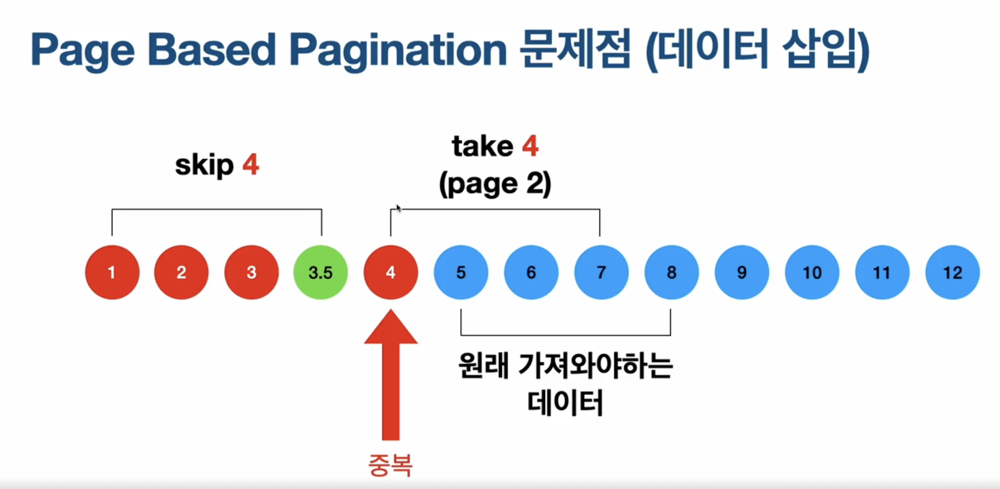
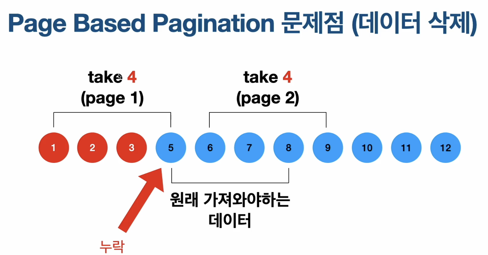
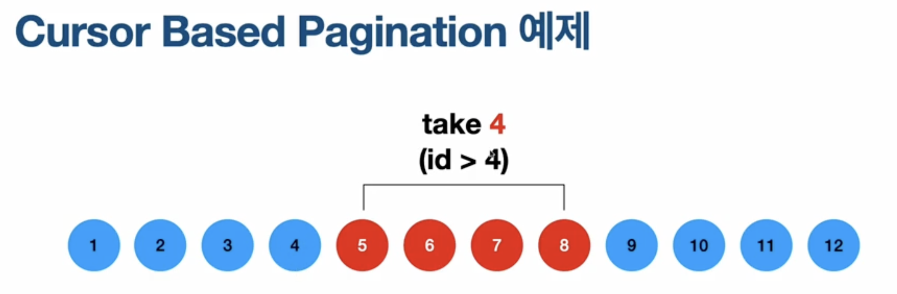

# Pagination

- Technique to retrieve much data by partially diving them

## Characteristic

- Does not retrieve all data corresponding to the query, but divided.

# Page Based Pagination

- Divide request based on page
- Specify the number of data to retrieve and which page
- Common for UI that uses page number to switch pages
- While pagination, if the data is added or deleted from the database, the saving data can be omitted or duplicated
    - Intended to take 4 for page 1, page 2 should be 5~8
        - Addition
            
            
            
        
        Added 0 after taking page 1, for page 2 it will skip 4 and take 4, so the result is 4~7
        
        - Deletion
        
            
        
    
    Delete 4 after page 1, for page 2 it will skip 1~5 and take 6~9 as the result, but initially intended 5~8
    
- Easy algorithm for pagination
- Not used for mobile app

# Cursor Based Pagination

- Retrieve new data with reference to latest retrieved data
- When sending request, specify latest data’s reference value (Unique values like ID) and how many data to retrieve

- Common used in scroll like list (E.g. ListView)
- Low possibility of data omission or duplication as query is based on latest data’s reference value
- Common for mobile app, used for any UI take uses scroll for loading data

